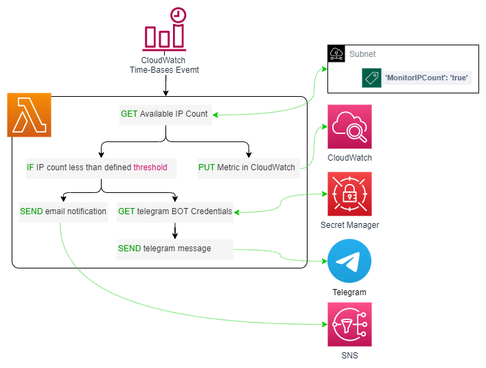
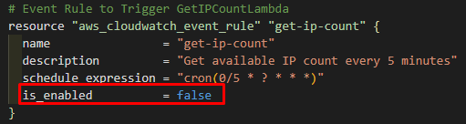

# Get Available IP Count in a Subnet

This terraform deployment creates a python lambda function that checks every 5 minutes for the number of available IPs on each subnet that is pre-tagged for monitoring and, based on a threshold, sends an email and telegram notification with the warning and a detail.

## Resources deployed by this manifest:

- Python Lambda Function
- CloudWatch time-based event.
- Secrets Manager Secret with Telegram BOT Token and User ID.
- IAM Role
- SNS Topic
- SNS Suscriptions

### Solution diagram:



## Tested with: 

| Environment | Application | Version  |
| ----------------- |-----------|---------|
| WSL2 Ubuntu 20.04 | Terraform | v1.1.8  |

## Initialization How-To:

Located in the root directory: 

Make an "aws configure" to log into the aws account, and a "terraform init" to download the necessary modules and start the backend.

```bash
aws configure
terraform init
```

Create an .env file with your Telegram BOT credentials, like the following:

```bash
# Replace the values with the ones from your Telegram BOT.
export TF_VAR_TOKEN=000000000000000000000000000000000
export TF_VAR_USER_ID=0000000000000000000
```
And set the environment values:

```bash
source .env
```

## Deployment How-To:

Located in the root directory, make the necessary changes in the variables.tf file and run the manifests:

```bash
terraform apply
```
> :warning: To avoid unwanted charges, the event rule is disabled, to enable it, change the "is_enabled" value to "true" in the cloudwatch.tf file. :warning:



## Author:

- [@JManzur](https://jmanzur.com)

## Documentation:

- [Telegram Documentation: Bots, An introduction for developers](https://core.telegram.org/bots)
- [Python boto3 documentation for SNS](https://boto3.amazonaws.com/v1/documentation/api/latest/reference/services/sns.html)